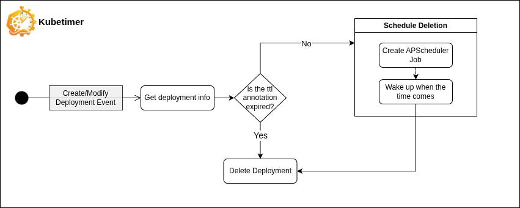

<p align="center">
  <picture>
    
  </picture>
</p>

<p align="center">
  <strong>Automatically delete Kubernetes resources when their time is up.</strong>
</p>

---

## Why KubeTimer?

How many preview environments are still running from last week's pull request? How many dev deployments are sitting idle, burning cloud credits for nothing?

**KubeTimer** is a lightweight Kubernetes operator that watches for a TTL (Time-To-Live) annotation on your resources and **automatically deletes them when the time expires** — no cron jobs, no manual cleanup, no wasted money.

It was designed for two common scenarios:

- **Temporary environments** — Preview, QA, or demo deployments that should self-destruct after a set time. Annotate them at creation and forget about it.
- **Cost reduction** — Stop paying for idle resources that outlive their purpose. KubeTimer ensures nothing sticks around longer than it should.

## Origin

KubeTimer was created by [Ryan Carvalho](https://github.com/ryanjorgeac) as a **university final project**, with the goal of contributing a useful tool to the Kubernetes community. The project is public and aims to follow open-source best practices as it matures.

> **Note:** KubeTimer currently handles **Deployments** only. Support for other resource types (Pods, StatefulSets, Jobs, etc.) is planned for future releases.

---

## How It Works

KubeTimer is **event-driven, not poll-based**. It reacts instantly to changes instead of scanning on a timer.

<p align="center">
  <picture>
    
  </picture>
</p>

<p align="center">
  <strong>Automatically delete Kubernetes resources when their time is up.</strong>
</p>


### The flow

1. **Annotate** a Deployment with a duration string (e.g. `kubetimer.io/ttl: "30m"`, `"2h"`, `"7d"`).
2. **Kopf watches** detect the annotation, compute the expiry time (`now + duration`), store it as a `kubetimer.io/expires-at` annotation on the Deployment, and schedule an [APScheduler](https://apscheduler.readthedocs.io/) `DateTrigger` job to fire at that time.
3. **When the time comes**, the job re-reads the Deployment from the API, verifies the UID still matches (guards against recreated resources) and the TTL is still expired, then deletes it.

 **On startup**, KubeTimer reconciles by listing all annotated Deployments: expired ones are bulk-deleted immediately; future ones get scheduled.

### Safety features

- **Re-verification before delete** — The operator re-reads the resource and checks UID + TTL before every deletion. If the resource was recreated or the annotation changed, the delete is skipped.
- **Dry-run mode** — Set `KUBETIMER_DRY_RUN=true` to log what *would* be deleted without actually removing anything. Great for testing in production.
- **Namespace filtering** — Include or exclude specific namespaces from being watched.

---

## Quick Start

### Annotate a Deployment

Add the TTL annotation with a **duration string** indicating how long the Deployment should live after creation:

```yaml
apiVersion: apps/v1
kind: Deployment
metadata:
  name: my-preview-app
  namespace: preview
  annotations:
    kubetimer.io/ttl: "2h"  # Delete 2 hours after creation
spec:
  replicas: 1
  selector:
    matchLabels:
      ...
```

Supported units: `s` (seconds), `m` (minutes), `h` (hours), `d` (days). Examples: `30m`, `2h`, `7d`.

The operator will automatically compute the expiry time and store it in a `kubetimer.io/expires-at` annotation (ISO 8601 UTC). When that time arrives, KubeTimer deletes the Deployment.

### Deploy to your cluster

The quickest way to get KubeTimer running:

```bash
# Clone the repository
git clone https://github.com/ryanjorgeac/kubetimer.git
cd kubetimer

# Deploy (creates namespace, RBAC, and operator Deployment)
./deploy.sh
```

This will:
1. Create the `kubetimer-system` namespace
2. Set up the required ServiceAccount, ClusterRole, and ClusterRoleBinding
3. Deploy the operator (`ryanjorgeac/kubetimer` image)
4. Wait for the rollout to complete

You can also pull the image directly:

```bash
docker pull ryanjorgeac/kubetimer:latest
```

---

## Configuration

KubeTimer is configured entirely through environment variables, all prefixed with `KUBETIMER_`. A `.env` file is also supported.

| Variable | Default | Range | Description |
|---|---|---|---|
| `KUBETIMER_LOG_LEVEL` | `INFO` | `DEBUG`, `INFO`, `WARNING`, `ERROR` | Logging level for the operator |
| `KUBETIMER_LOG_FORMAT` | `text` | `json`, `text` | Log format (`json` for production, `text` for development) |
| `KUBETIMER_KOPF_LOG_LEVEL` | `WARNING` | `DEBUG`, `INFO`, `WARNING`, `ERROR` | Logging level for the Kopf framework |
| `KUBETIMER_ANNOTATION_KEY` | `kubetimer.io/ttl` | Valid K8s annotation key | Annotation key to watch for TTL values |
| `KUBETIMER_NAMESPACE_INCLUDE` | `""` (all) | Comma-separated | Namespaces to include (empty means all) |
| `KUBETIMER_NAMESPACE_EXCLUDE` | `kube-system,kube-public,kube-node-lease` | Comma-separated | Namespaces to exclude from watching |
| `KUBETIMER_TIMEZONE` | `UTC` | IANA timezone | Timezone for TTL comparison (e.g. `America/New_York`) |
| `KUBETIMER_DRY_RUN` | `false` | `true`, `false` | Log deletions without actually deleting |
| `KUBETIMER_MAX_CONCURRENT_DELETES` | `25` | 1–200 | Max concurrent K8s delete API calls |
| `KUBETIMER_LIST_PAGE_SIZE` | `1000` | 50–5000 | Page size for K8s paginated list calls |
| `KUBETIMER_CONNECTION_POOL_SIZE` | `50` | 4–200 | urllib3 pool size and ThreadPoolExecutor workers |
| `KUBETIMER_API_TIMEOUT_CONNECT` | `5` | 1–30 | Connect timeout (seconds) for K8s API calls |
| `KUBETIMER_API_TIMEOUT_READ` | `30` | 5–120 | Read timeout (seconds) for K8s API calls |

### Example: Operator Deployment with custom config

```yaml
containers:
  - name: operator
    image: ryanjorgeac/kubetimer:latest
    env:
      - name: KUBETIMER_LOG_FORMAT
        value: "json"
      - name: KUBETIMER_TIMEZONE
        value: "America/Sao_Paulo"
      - name: KUBETIMER_DRY_RUN
        value: "false"
      - name: KUBETIMER_NAMESPACE_EXCLUDE
        value: "kube-system,kube-public,kube-node-lease,monitoring"
```

---

## Development

### Prerequisites

- **Python** ≥ 3.14
- **[uv](https://docs.astral.sh/uv/)** — fast Python package manager
- **kubectl** and a running Kubernetes cluster (for live testing)

### Setup

```bash
# Install dependencies
uv sync

# Editable install
make install

# Run locally (requires kubeconfig)
python kubetimer/main.py
```

### Commands

| Command | Description |
|---|---|
| `make test` | Run unit tests |
| `make coverage` | Run tests with coverage report |
| `make format` | Auto-format code with Black |
| `make lint` | Lint with Flake8 |
| `make typecheck` | Type-check with mypy |
| `make check` | Run all checks (format + lint + typecheck + test) |
| `make fix` | Auto-format + lint |

### Testing tools

The `tests/` directory includes operational testing scripts for live clusters:

| Script | Purpose |
|---|---|
| `generate_zombies.py` | Creates zero-replica Deployments with randomised TTLs to simulate real workloads |
| `generate_load.py` | Bulk-creates 2,000 expired Deployments for reconciliation stress testing |
| `measure.py` | Benchmarks how fast the operator deletes a batch of expired Deployments |
| `monitor_logs.py` | Streams operator logs in real time with event count summaries |
| `monitor_resources.py` | Polls the Metrics API and prints CPU/memory statistics with ASCII charts |
| `cleanup_zombies.py` | Cleans up all test Deployments |

---

## Documentation

Full documentation is being developed in a separate project and will be available at:

🔗 **[kubetimer.github.io](https://kubetimer.github.io)**

> *Repository: [github.com/kubetimer/kubetimer.github.io](https://github.com/kubetimer/kubetimer.github.io)*

---

## License

This project is licensed under the **MIT License** — see the [LICENSE](LICENSE) file for details.

Copyright © 2026 Ryan Carvalho

---

## Give a Star! ⭐

If you find KubeTimer useful or interesting, please consider giving it a star on GitHub. It helps the project grow and motivates further development!

<!-- Badge reference links -->
[ci-badge]: https://github.com/ryanjorgeac/kubetimer/actions/workflows/test.yml/badge.svg
[ci-workflow]: https://github.com/ryanjorgeac/kubetimer/actions/workflows/test.yml
[coverage-badge]: https://coveralls.io/repos/github/ryanjorgeac/kubetimer/badge.svg?branch=main
[coverage]: https://coveralls.io/github/ryanjorgeac/kubetimer?branch=main
[license-badge]: https://img.shields.io/badge/License-MIT-blue.svg
[license]: https://github.com/ryanjorgeac/kubetimer/blob/main/LICENSE
